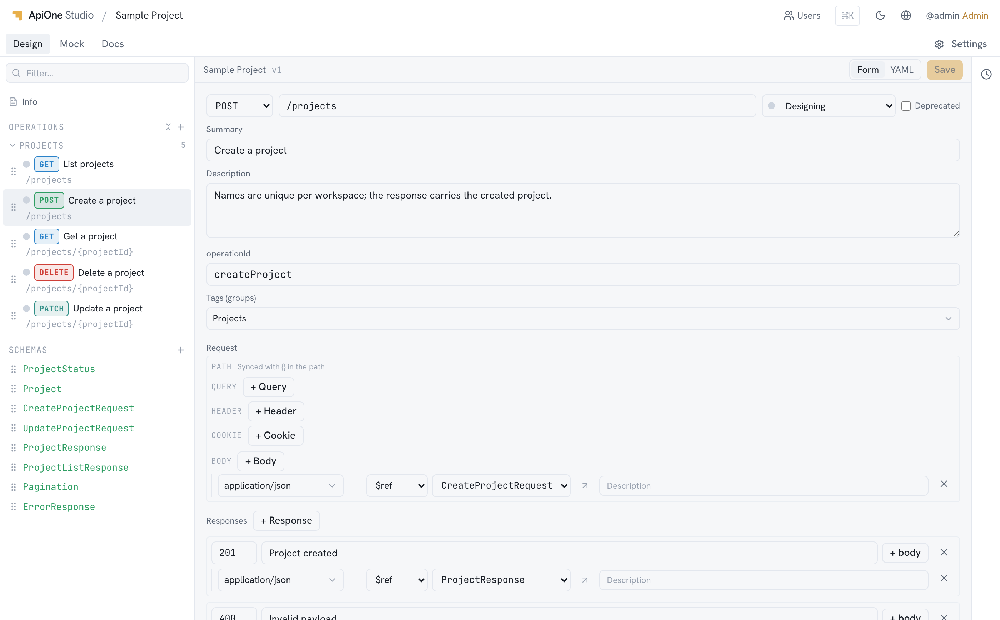

<p align="center">
  
</p>

<h1 align="center">ApiOne Studio</h1>

<p align="center">
  OpenAPI-first，设计、文档、Mock 三合一。
</p>

<p align="center">
  <a href="README.md">English</a> | 简体中文
</p>



## 这是什么

一个 OpenAPI-first 的接口管理平台，基于 OpenAPI 文件包装了表单 / YAML 编辑器、版本历史、 Mock 服务和用户管理等功能。

## 功能

- **设计** —— 实时同步的表单<=>YAML 编辑器。
- **Mock** —— 基于接口 schema 自动 Mock，也可通过沙箱执行自行编写的 JavaScript 代码。
- **文档** —— 采用 [Scalar](https://github.com/scalar/scalar) 渲染。
- **版本管理** —— 保存自带版本号和操作者，可 diff，可还原。
- **协作** —— 多项目，多角色，冲突提示。
- **界面语言** —— 支持 English、简体中文、日本語等多种语言。
- **导入 / 导出** —— 支持 OpenAPI 3、Swagger 2、Postman 集合；支持导出 YAML、JSON、离线 HTML 页面。
- **支持 API 调用** —— 自带 Agent Skill，可通过 API Token 托付给您自己的 AI Agent 进行管理，也可自行调用 API 进行管理。

## 快速开始

### Docker

```bash
docker run -d -p 4100:4100 -v apione-data:/data ghcr.io/iamjava-com/apione-studio
```

### Node

```bash
npm run setup
npm run build
npm start
```

启动 <http://localhost:4100>。

## 开发

需要 **Node 24**

```bash
npm run setup   # 安装 apps/server 与 apps/web
npm run dev     # 后端 :4100，前端 :5173
```

启动 <http://localhost:5173>。

## 许可证

[MIT](LICENSE)

[THIRD-PARTY-NOTICES.md](THIRD-PARTY-NOTICES.md)
